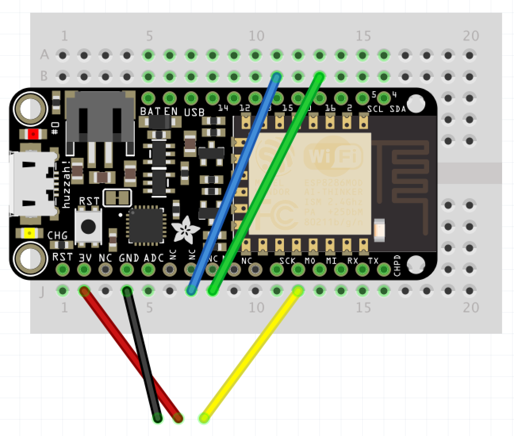

# IoT Engineering
## Terrarium - Monitoring and Control System

A temperatur, humidity and reaction monitoring system with configurable temperature, humidity and alerts.
Control the values with the Terrarium-Box and with the included [WebApplication](https://fhnw-iot-5ibb1.github.io/fhnw-iot-project-nadia-benjamin/TerrariumWebApp.html) which can be used on Mobile and Desktop.


## Introduction
This project is part of the [IoT Engineering](../../../fhnw-iot) course.

* 2-person teams, building an IoT system.
* 32 hours of work per person, 1 prototype.
* 10' presentation of the project at Demo Day.
* Slides, source code and setup steps on GitHub.
* Both team members are able to explain the project.

### Team members

* [Benjamin Brodwolf](https://github.com/BenjaminBrodwolf) 
* [Nadia Kramer](https://github.com/nadiakramer)

## Deliverables


### Source code

[Arduino/ESP8266_DTH11_rgbLED_Device.ino](Arduino/ESP8266_DTH11_rgbLED_Device/ESP8266_DTH11_rgbLED_Device.ino)

[Arduino/ESP8266_Ultrasonic_redLED_Device.ino](Arduino/ESP8266_Ultrasonic_redLED_Device/ESP8266_Ultrasonic_redLED_Device.ino)

[TerrariumWebApp.html (JavaScript)](TerrariumWebApp.html)


### Sensor/Actuator Device: DTH11 / RGB-LED 


##### Source code
* [Arduino/ESP8266_DTH11_rgbLED_Device.ino](Arduino/ESP8266_DTH11_rgbLED_Device/ESP8266_DTH11_rgbLED_Device.ino)

##### Setup hardware
* The actuator device consists of a [ESP8266](https://github.com/tamberg/fhnw-iot/wiki/Feather-Huzzah-ESP8266), [Grove adapter](https://github.com/tamberg/fhnw-iot/wiki/Grove-Adapters#grove-shield-for-feather), [Chainable RGB LED
](https://github.com/tamberg/fhnw-iot/wiki/Grove-Actuators#user-content-chainable-rgb-led), [rotary angle sensor](https://github.com/tamberg/fhnw-iot/wiki/Grove-Sensors#rotary-angle-sensor), [DHT11 sensor](https://github.com/tamberg/fhnw-iot/wiki/Grove-Sensors#temperature--humidity-sensor-dht11) and a [display](https://github.com/tamberg/fhnw-iot/wiki/Grove-Actuators#4-digit-display-tm1637).
* Stack the ESP8266 on top of the Grove adapter.
* Connect the Chainable RGB to LED to D2, rotary angle sensor to A0, DHT11 sensor to pin 13 (see Note!) and display to D5 of the Grove adapter.

Note: the connect the DTH11 sensor with the ESP8266 you need to redirect pin 16 and pin 15 using the blue / green jumper cable to Grove connector A2.



**Special Thanks to Mr.Amberg [(@tamberg)](https://github.com/tamberg) for his help to archieve this fix**


### Sensor/Actuator Device: Ultrasonic-Range / RED-LED 


##### Source code
* [Arduino/ESP8266_Ultrasonic_redLED_Device.ino](Arduino/ESP8266_Ultrasonic_redLED_Device/ESP8266_Ultrasonic_redLED_Device.ino)

##### Setup hardware
* The actuator device consists of a [ESP8266](https://github.com/tamberg/fhnw-iot/wiki/Feather-Huzzah-ESP8266), [Grove adapter](https://github.com/tamberg/fhnw-iot/wiki/Grove-Adapters#grove-shield-for-feather), [LED](https://github.com/tamberg/fhnw-iot/wiki/Grove-Actuators#led), [rotary angle sensor](https://github.com/tamberg/fhnw-iot/wiki/Grove-Sensors#rotary-angle-sensor), [Ultrasonic Ranger](https://github.com/tamberg/fhnw-iot/wiki/Grove-Sensors#user-content-ultrasonic-ranger) and a [display](https://github.com/tamberg/fhnw-iot/wiki/Grove-Actuators#4-digit-display-tm1637).
* Stack the ESP8266 on top of the Grove adapter.
* Connect the LED to D2 (see Note!), rotary angle sensor to A0, ultrasoni ranger to D3 and display to I2C_1 of the Grove adapter.

Note: connect the LED adapter only after the reset and when the ESP8266 Wi-Fi connection is establishd.

#### Same Setup for both devices

* Set Wi-Fi credentials

    ```
    const char *ssid = "MY_SSID";
    const char *password = "MY_PASSWORD";
    ```
    
 * Set Firebase credentials

    ```
   //FirebaseESP8266.h must be included before ESP8266WiFi.h
   #include <FirebaseArduino.h>
 
   #define FIREBASE_HOST "?????????????.firebaseio.com"
   #define FIREBASE_AUTH "AUTH KEY"
    ```
    


### Setup Firebase
***HINT: ESP8266 Core SDK must be at least 2.4.1.***

#### Firebase  Software
 * Install Arduino json library: Install version 5.13.1 (and not the possible latest !!!) [Watch install video](https://youtu.be/GUTpaY1YaXo)
* Install Firebase library: Download latest stable build [HERE](https://github.com/FirebaseExtended/firebase-arduino/releases/tag/v0.3) > unzip in "Documents\Arduino\libraries"
**NOTE, There is a bug in "v0.3 Bi-directional streaming support" > update fingerprint**
 - Open file ***FirebaseHttpClient.h*** and replace fingerprint: *6F D0 9A 52 C0 E9 E4 CD A0 D3 02 A4 B7 A1 92 38 2D CA 2F 26*
[CLICK HERE FOR INFO](https://github.com/FirebaseExtended/firebase-arduino/issues/373)

#### Firebase Backend
* [Create Firebase Project](https://console.firebase.google.com)
* Create a * *Realtime Database* *
* Edit Project Rules: Database(Realtime Database) > rules:
```
{
  /* Visit https://firebase.google.com/docs/database/security to learn more about security rules. */
  "rules": {
    ".read": true,
    ".write": true
  }
}
```

### Setup WebApp (Static-HTML)

* In the HEAD:
```html
    <!-- The core Firebase JS SDK is always required and must be listed first -->
    <script src="https://www.gstatic.com/firebasejs/7.6.1/firebase-app.js"></script>

    <!-- TODO: Add SDKs for Firebase products that you want to use
     https://firebase.google.com/docs/web/setup#available-libraries -->
    <script src="https://www.gstatic.com/firebasejs/7.6.1/firebase-database.js"></script>
```

* To initialize Firebase in your WebApp, you need to provide your App's Firebase project configuration.
```javascript
const firebaseConfig = {
  apiKey: "api-key",
  authDomain: "project-id.firebaseapp.com",
  databaseURL: "https://project-id.firebaseio.com",
  projectId: "project-id",
  storageBucket: "project-id.appspot.com",
  messagingSenderId: "sender-id",
  appId: "app-id",
  measurementId: "G-measurement-id",
};
```

* To GET and SET Data from/to Firebase-Realtime-Database
```javascript
          // Initialize Firebase
          firebase.initializeApp(firebaseConfig);

          // handl the recieved Data
          const gotData = data => {
            const {
                alarm,
                checkDistance,
                desiredHumidity,
                desiredTemp,
                measuredHumidity,
                measuredTemp,
                reactionAlarm,
                connection
            } = data.val();

            // ...
        }

        // error Handling
        const errData = err => {
            console.log("errData: " + err)
        }

        // referenc to the Firebase-Dabase
        const ref = firebase.database().ref();

        // get Data from Firebase-Database when Value changes
        ref.on("value", gotData, error);

        // update Value to the Firebase-Database (so the ESP8266 can get it)
        const setValueToDatabase = (attribute, value) => {
            const obj = {
                [attribute]: parseInt(value, 10)
            }
            ref.update(obj);
        }
```


### Presentation
4-slide presentation, PDF format, committed to (this) project repo.

[Docs/Terrarium_Presentation.pdf](Terrarium_Presentation.pdf)

#### Use-case
* Measures temperature, humidity and movements
* Shows temperature and humidity on the display
* Desired temperature and humidity can be set
* Warms or cools the terrarium (shown with chainable LED)
* Receive an alarm if the animal has not moved for a certain period
* Motionlessness alarm can be set

#### Reference model


#### Interface documentation.
`
curl -X POST -d '{"temp" : "23", "humi" : "33"}' \ 'https://[PROJECT_ID].firebaseio.com/message_list.json'
`

### Live demo
Working end-to-end prototype, "device to cloud", part of your 10' presentation.

[https://TerrariumWebApp.html](https://fhnw-iot-5ibb1.github.io/fhnw-iot-project-nadia-benjamin/TerrariumWebApp.html)

1) Sensor input on a IoT device triggers an event.
2) The event or measurement shows up online, in an app or Web client.
3) The event triggers actuator output on the same or on a separate IoT device.

## Submission deadline
Commit and push to (this) project repo before Demo Day, _13.01.2020, 00:00_.
