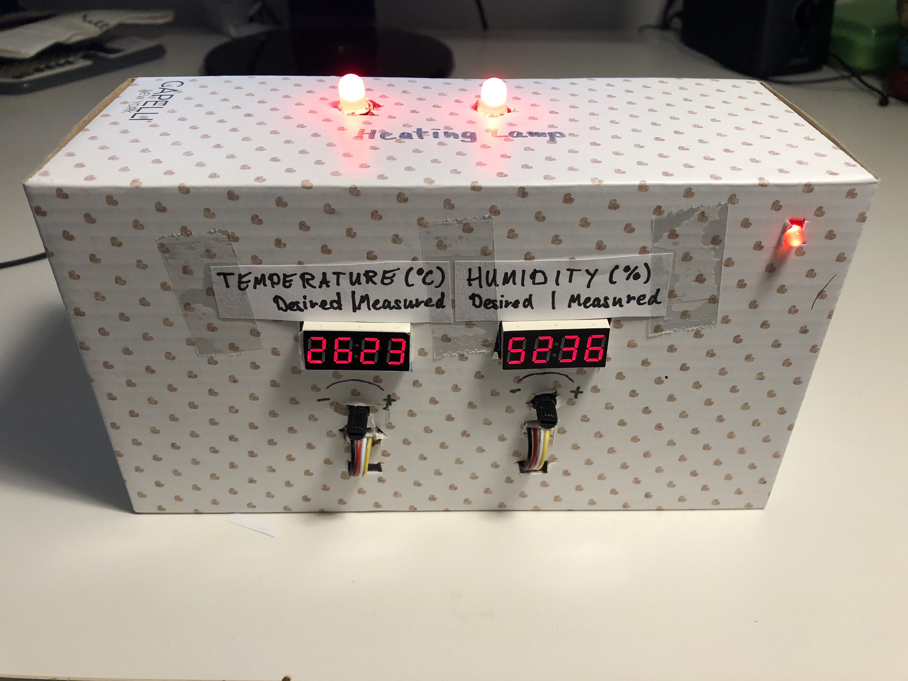
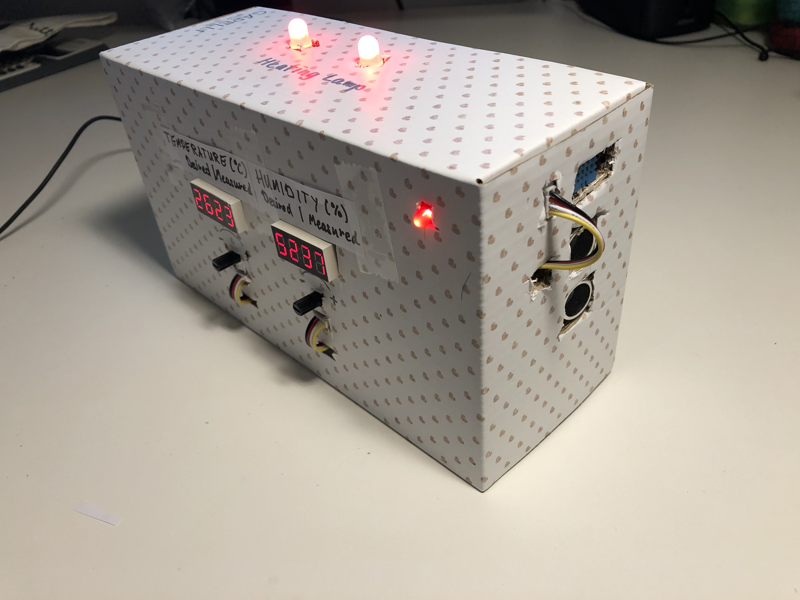
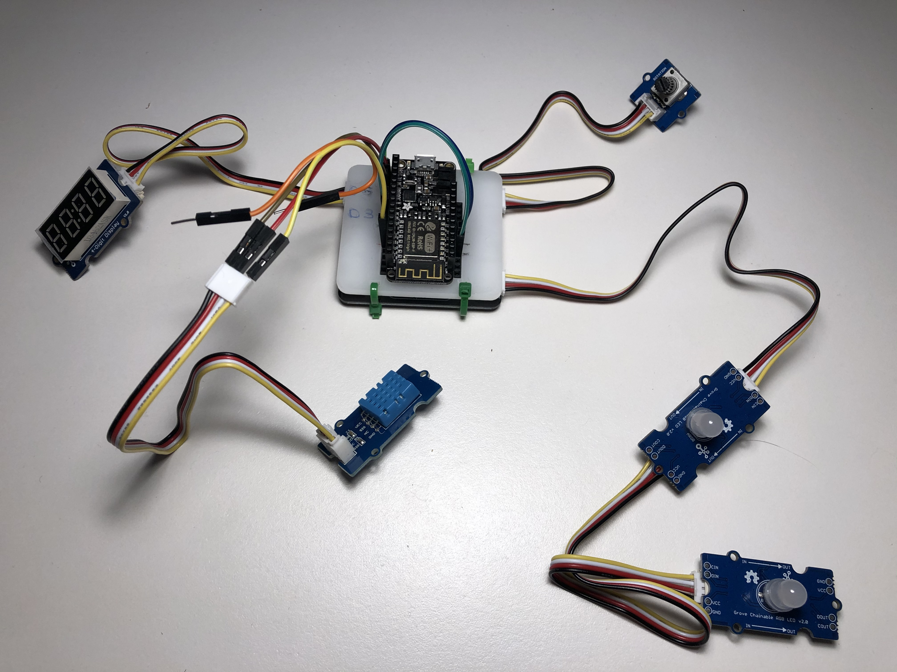
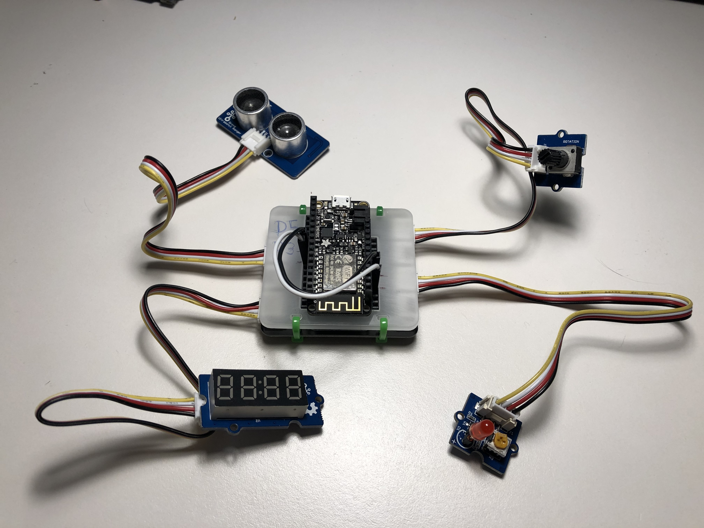

# IoT Engineering
## Terrarium - Monitoring and Control System

A temperatur, humidity and reaction monitoring system with configurable temperature, humidity and alerts.
Control the values with the Terrarium-Box and with the included [WebApplication](https://fhnw-iot-5ibb1.github.io/fhnw-iot-project-nadia-benjamin/TerrariumWebApp.html) which can be used on Mobile and Desktop.





## Introduction
This project is part of the [IoT Engineering](../../../fhnw-iot) course.

* 2-person teams, building an IoT system.
* 32 hours of work per person, 1 prototype.
* 10' presentation of the project at Demo Day.
* Slides, source code and setup steps on GitHub.
* Both team members are able to explain the project.

### Team members

* [Benjamin Brodwolf](https://github.com/BenjaminBrodwolf) 
* [Nadia Kramer](https://github.com/nadiakramer)

## Deliverables


### Source code

[Arduino/ESP8266_DTH11_rgbLED_Device.ino](Arduino/ESP8266_DTH11_rgbLED_Device/ESP8266_DTH11_rgbLED_Device.ino)

[Arduino/ESP8266_Ultrasonic_redLED_Device.ino](Arduino/ESP8266_Ultrasonic_redLED_Device/ESP8266_Ultrasonic_redLED_Device.ino)

[TerrariumWebApp.html (JavaScript)](TerrariumWebApp.html)


### Sensor/Actuator Device: DTH11 / RGB-LED 
Feather Huzzah ESP8266



##### Source code
* [Arduino/ESP8266_DTH11_rgbLED_Device.ino](Arduino/ESP8266_DTH11_rgbLED_Device/ESP8266_DTH11_rgbLED_Device.ino)


### Sensor/Actuator Device: Ultrasonic-Range / RED-LED / Alert 
Feather Huzzah ESP8266



##### Source code
* [Arduino/ESP8266_DTH11_rgbLED_Device.ino](Arduino/ESP8266_DTH11_rgbLED_Device/ESP8266_DTH11_rgbLED_Device.ino)


### Setup Firebase-Backend
#HINT: ESP8266 Core SDK must be at least 2.4.1.

 * Install Arduino json library: Install version 5.13.1 (and not the possible latest !!!) [Watch how do install Arduino-Json Library](https://youtu.be/GUTpaY1YaXo)
* Install Firebase library: Download latest stable build [HERE](https://github.com/FirebaseExtended/firebase-arduino/releases/tag/v0.3) > unzip in "Documents\Arduino\libraries"
**NOTE, There is a bug in "v0.3 Bi-directional streaming support" > update fingerprint** Open file ****FirebaseHttpClient.h*** and replace with this fingerprint: *6F D0 9A 52 C0 E9 E4 CD A0 D3 02 A4 B7 A1 92 38 2D CA 2F 26*
[CLICK HERE FOR INFO](https://github.com/FirebaseExtended/firebase-arduino/issues/373)
* [Create Firebase Project] (https://console.firebase.google.com)
* Firebase, Project Rules: Database(Realtime Database) > rules 
```
{
  /* Visit https://firebase.google.com/docs/database/security to learn more about security rules. */
  "rules": {
    ".read": true,
    ".write": true
  }
}
```


### Same Setup software for both devices

* Set Wi-Fi credentials

    ```
    const char *ssid = "MY_SSID";
    const char *password = "MY_PASSWORD";
    ```
    
 * Set Firebase credentials

    ```
  TODO
    ```
      
    
... (adapt as required)

1) Embedded code / microcontroller firmware.
2) Glue Code used on the gateway or "in the cloud".
3) App or Web UI code, or IoT platform setup steps.

### Presentation
4-slide presentation, PDF format, committed to (this) project repo.

[MY_TEAM_PROJECT_PRESENTATION.pdf](MY_TEAM_PROJECT_PRESENTATION.pdf)

1) Use-case of your project.
2) Reference model of your project.
3) Single slide interface documentation.
4) Issues you faced, how you solved them.

### Live demo
Working end-to-end prototype, "device to cloud", part of your 10' presentation.

[https://TerrariumWebApp.html](https://fhnw-iot-5ibb1.github.io/fhnw-iot-project-nadia-benjamin/TerrariumWebApp.html)

1) Sensor input on a IoT device triggers an event.
2) The event or measurement shows up online, in an app or Web client.
3) The event triggers actuator output on the same or on a separate IoT device.

## Submission deadline
Commit and push to (this) project repo before Demo Day, _13.01.2020, 00:00_.
